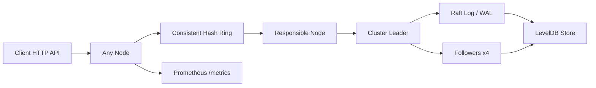

# Distributed Key-Value Store

A Go 1.22+ distributed key-value store that demonstrates a Raft-style control plane, LevelDB-backed persistence, consistent hashing, gRPC peer RPCs, REST access, Prometheus metrics, Docker Compose, and benchmark tooling.

## Architecture



## Layout

- `cmd/server`: node entrypoint
- `cmd/client`: lightweight CLI client
- `internal/raft`: leader election, log replication, and peer RPC handlers
- `internal/store`: LevelDB persistence and snapshotting
- `internal/hash`: consistent hashing with virtual nodes
- `internal/grpc`: custom gRPC peer transport
- `internal/api`: HTTP API handlers and server
- `docker`: container build and 5-node compose setup
- `monitoring`: Prometheus and Grafana assets
- `benchmarks`: simple HTTP benchmark driver

## Running a 5-Node Cluster

1. Install Go 1.22+ and Docker.
2. Start the cluster:

```bash
docker compose -f docker/docker-compose.yml up --build
```

3. The nodes listen on:
- node1: `http://localhost:8081`
- node2: `http://localhost:8082`
- node3: `http://localhost:8083`
- node4: `http://localhost:8084`
- node5: `http://localhost:8085`

## API

- `GET /kv/{key}`
- `PUT /kv/{key}` with `{ "value": "...", "ttl": "30s" }`
- `DELETE /kv/{key}`
- `GET /admin/status`
- `GET /admin/distribution`
- `GET /metrics`

## Design Decisions

- Raft-style replication provides leader election and quorum-based writes.
- LevelDB provides durable WAL-backed local persistence and lightweight snapshots.
- Consistent hashing with 150 virtual nodes minimizes key remapping during membership changes.
- gRPC keeps peer communication fast and strongly typed while staying separate from the client-facing HTTP API.

## Benchmark Targets

The project includes `benchmarks/bench.go` for HTTP load generation. The table below shows target outcomes for the 5-node cluster.

| Metric | Target |
| --- | --- |
| Throughput | 100K+ ops/sec |
| P99 read latency | < 5 ms |
| P99 write latency | < 20 ms |
| Leader failover | < 2 s |
| Data loss on leader crash | 0 |

## Failure Scenarios

- Leader crash: followers time out, run election, and promote a new leader.
- Node loss: consistent hashing remaps only the affected key ranges.
- Expired keys: TTL enforcement removes stale values before reads return them.
- Snapshot replay: the store restores from the latest compressed snapshot and then replays the log.

## Notes

This workspace snapshot was assembled without a local Go toolchain, so validate the build once Go 1.22+ is available on the machine.
