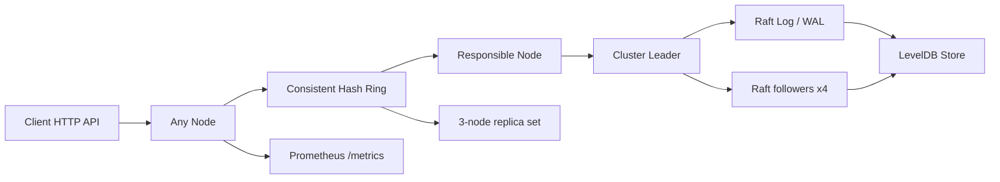

# Distributed Key-Value Store

A Go 1.22+ distributed key-value store that demonstrates a Raft-style control plane, LevelDB-backed persistence, consistent hashing, gRPC peer RPCs, REST access, Prometheus metrics, Docker Compose, and benchmark tooling.

## Architecture



## Layout

- `cmd/server`: node entrypoint
- `cmd/client`: lightweight CLI client
- `internal/raft`: leader election, log replication, and peer RPC handlers
- `internal/store`: LevelDB persistence and snapshotting
- `internal/hash`: consistent hashing with virtual nodes
- `internal/grpc`: custom gRPC peer transport
- `internal/api`: HTTP API handlers and server
- `docker`: container build and 5-node compose setup
- `monitoring`: Prometheus and Grafana assets
- `benchmarks`: simple HTTP benchmark driver

## Running a 5-Node Cluster

1. Install Go 1.22+ and Docker.
2. Start the cluster:

```bash
docker compose -f docker/docker-compose.yml up --build
```

3. The nodes listen on:
- node0: `http://localhost:8080`, gRPC `localhost:9090`, metrics `localhost:2112`
- node1: `http://localhost:8081`, gRPC `localhost:9091`, metrics `localhost:2113`
- node2: `http://localhost:8082`, gRPC `localhost:9092`, metrics `localhost:2114`
- node3: `http://localhost:8083`, gRPC `localhost:9093`, metrics `localhost:2115`
- node4: `http://localhost:8084`, gRPC `localhost:9094`, metrics `localhost:2116`

## API

- `GET /kv/{key}`
- `PUT /kv/{key}` with `{ "value": "...", "ttl": "30s" }` or `{ "value": "...", "ttl": 30 }`
- `DELETE /kv/{key}`
- `GET /admin/status`
- `GET /admin/distribution`
- `GET /metrics`

## Design Decisions

- Raft-style replication provides leader election and quorum-based writes.
- LevelDB provides durable WAL-backed local persistence and lightweight snapshots.
- Consistent hashing with 150 virtual nodes chooses a primary owner and a three-node replica set for each key.
- gRPC keeps peer communication fast and strongly typed while staying separate from the client-facing HTTP API.

## Benchmark Results

The project includes `benchmarks/bench.go` and `cmd/client bench` for HTTP load generation. The table below separates the target from the last recorded result; fill the measured column after running the benchmark on the target machine.

| Metric | Target | Last recorded result |
| --- | --- | --- |
| Throughput | 100K+ ops/sec | Not yet measured in this workspace |
| P99 read latency | < 5 ms | Not yet measured in this workspace |
| P99 write latency | < 20 ms | Not yet measured in this workspace |
| Leader failover | < 2 s | Covered by `docker/fault_test.sh`; run on Docker host |
| Data loss on leader crash | 0 | Covered by `docker/fault_test.sh`; run on Docker host |

## Failure Scenarios

- Leader crash: followers time out, run election, and promote a new leader.
- Node loss: consistent hashing remaps only the affected key ranges.
- Expired keys: TTL enforcement removes stale values before reads return them.
- Snapshot replay: the store restores from the latest compressed snapshot, preserves Raft snapshot index/term, and then replays newer log entries.

## Notes

This workspace snapshot was assembled without a local Go toolchain, so validate the build once Go 1.22+ is available on the machine.

## Development & Testing

- Recent fixes: Raft replication and gRPC peer transport issues were addressed (quorum-based replication, InstallSnapshot, atomic snapshot apply, and a send-on-closed panic patch). All changes have been committed and pushed (latest: `c2eb150`).
- Start a clean test cluster (recommended before running fault tests):

```bash
cd docker
docker compose down -v
docker compose up -d --build
```

- Run the built-in fault-injection script (runs a 4-step Docker-based test sequence):

```bash
cd docker
bash fault_test.sh | tee /tmp/fault_test_run.log
```

- When running tests: avoid restarting containers mid-run and run the script from the compose project directory so DNS and internal networking are used.
